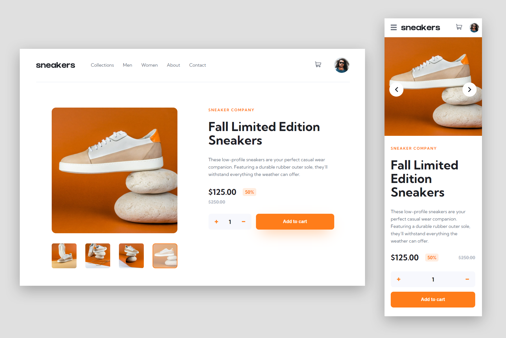

# E-commerce product page solution 👋

This is my solution to the [E-commerce product page challenge on Frontend Mentor](https://www.frontendmentor.io/challenges/ecommerce-product-page-UPsZ9MJp6).

## Overview

### The challenge 🙂

Users should be able to:

- View the optimal layout for the site depending on their device's screen size
- See hover states for all interactive elements on the page
- Open a lightbox gallery by clicking on the large product image
- Switch the large product image by clicking on the small thumbnail images
- Add items to the cart
- View the cart and remove items from it

### Links

Solution: https://devjoppe.github.io/ecommerce-product-page/

### Screenshots

**My solution**

### Mobile view

Mobile: 480px

## This was a challange 🥇

I wanted to build a solution where all the content for the web page is handled by JavaScript. This challenge was not an easy task for me, but I consider myself to have achieved my goal.

Could the code be written more efficiently? Probably. Am I using the most logical solutions? Maybe not, but it works and this has been a really good learning process.

### Built with

- JavaScript :+1:
- Semantic HTML5 markup
- SCSS/CSS custom properties
- Flexbox

### What to do differently next time?

More planning! :thinking: